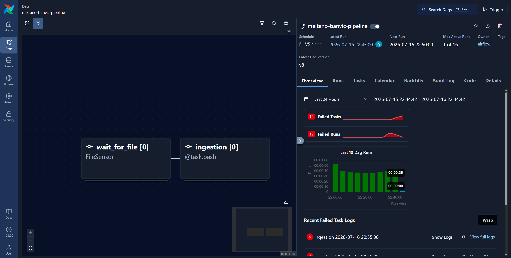
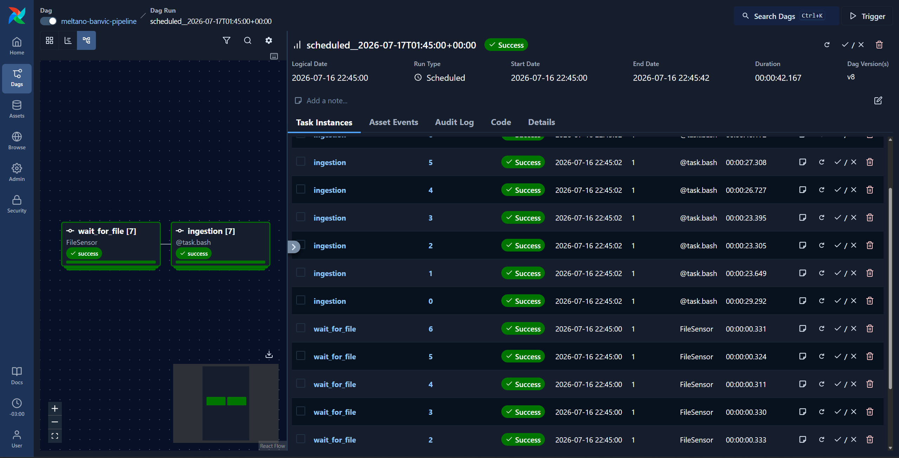

# BanVic Data Pipeline

A Meltano-based ELT pipeline orchestrated by Apache Airflow, running entirely in Docker, that moves data from a local source into a PostgreSQL data warehouse.

> This project was developed as part of the **[Indicium AI](https://indicium.ai/) Data Engineer Challenge**.

## Architecture

The project runs two main services in Docker:

- **Airflow**: orchestrates the pipeline and stores its own metadata (DAGs, task runs, connections, etc.) in a PostgreSQL database.
- **PostgreSQL**: a single Postgres instance that serves two purposes:
  - Airflow's metadata store.
  - A dedicated `warehouse` database, which is the destination for the pipeline data.
- **Meltano**: installed inside the same container as Airflow. It runs the actual data extraction and loading (EL) using its `tap` (source) and `target` (destination) plugins.

Data flow:

```
Local filesystem (source data)
        │
        ▼
   Meltano tap  ──────►  Meltano target  ──────►  PostgreSQL "warehouse" database
   (runs inside the Airflow container, triggered by an Airflow DAG)
```

In short: Airflow triggers a DAG that calls Meltano, which reads data from a local path on the host machine and loads it into the `warehouse` database inside the same Postgres instance used by Airflow for its metadata.

## Tech Stack

- **Apache Airflow** — pipeline orchestration
- **Meltano** — ELT framework (tap/target plugins)
- **PostgreSQL** — data warehouse + Airflow metadata store
- **Docker / Docker Compose** — containerization
- **Python 3.13**

## Project Structure

```
banvic-pipeline/
├── airflow/                 # Airflow DAGs, plugins, requirements
├── data/                    # Local source data
├── meltano-banvic/          # Meltano project (taps, targets, config)
├── .env.example             # Template for environment variables
├── .gitignore
├── docker-compose.yaml
└── README.md
```

## Prerequisites

- Docker installed
- Python 3.13 (recommended)

## Setup

### 1. Configure Meltano (optional, via CLI)

The project ships pre-configured, with Meltano installed inside the Docker container. If you need to edit the `tap` or `target` configuration using the Meltano CLI, set up a local virtual environment first:

```bash
py -3.13 -m venv .venv
source .venv/Scripts/activate
```

Install [`uv`](https://github.com/astral-sh/uv) for faster package installation:

```bash
pip install uv
uv pip install -r airflow/requirements.txt
```

This installs Meltano in your virtual environment, giving you access to the Meltano CLI inside the `meltano-banvic` folder.

### 2. Configure environment variables

Copy the example environment file and fill in your values:

```bash
cp .env.example .env
```

Edit `.env` with your configuration values.

### 3. Build and start the containers

```bash
docker compose build
docker compose up airflow-init
docker compose up -d
```

### 4. Access Airflow

Once the containers are running, Airflow is available at:

```
http://localhost:8080
```

Log in with your Airflow user and password.

### 5. Create an Airflow connection

Go to **Admin > Connections** (`http://localhost:8080/connections`) and click **Add Connection**.

- Use the same connection name referenced by `data_source_path` in `airflow/dags/banvic_pipeline`, **or**
- Choose a different name and update the `fs_conn_id` parameter in the DAG accordingly.

### 6. Trigger the pipeline

From the Airflow main page, select the `meltano-banvic-pipeline` DAG and click **Trigger** (then confirm by clicking **Trigger** again).

The DAG will run. You can click into individual tasks to inspect their logs and the underlying code.

## Troubleshooting

- **Port 8080 already in use**: stop whatever is using it, or change the exposed port in `docker-compose.yml`.
- **Connection errors when triggering the DAG**: double-check that the connection name created in step 5 matches `data_source_path` (or that `fs_conn_id` was updated to match).
- **Meltano plugin install errors**: try rebuilding the image with `docker compose build --no-cache`.

## Screenshots

```


```